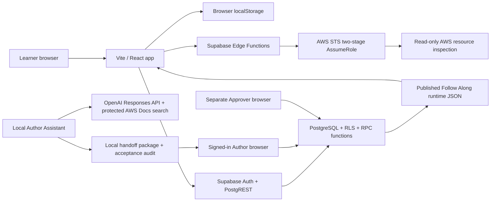
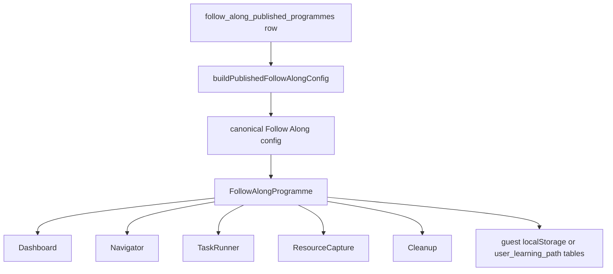
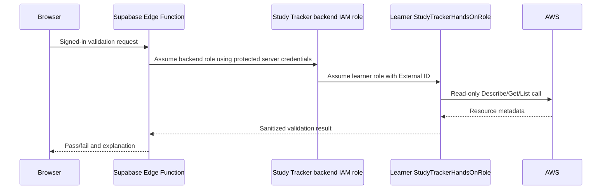
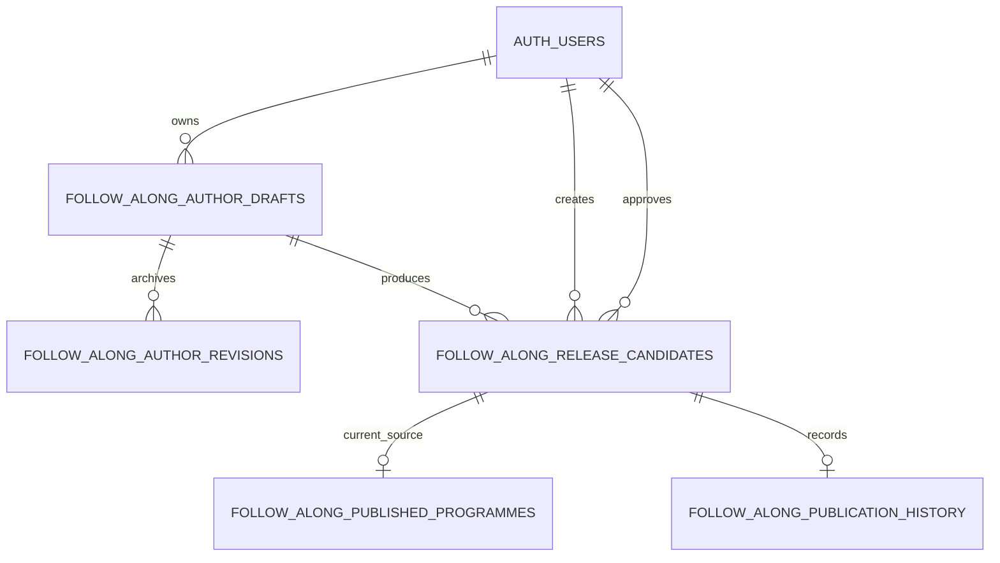

# Study Tracker Complete App Reference

**Application name:** Study Tracker / ExamPulse Prep AI  
**Repository:** `E:\code\study-tracker`  
**Reference date:** 11 August 2026  
**Document purpose:** A complete operational and architectural map of the application, its files, browser storage, Supabase database, Supabase Edge Functions, AWS validation path, Author Assistant, Author/Approver workflow, tests, migrations and known boundaries.

> Security note: this document names required environment variables and explains where credentials are used, but deliberately contains no API keys, passwords, access keys, service-role values or authentication tokens.

---

## Contents

1. Executive summary
2. System boundary and major technologies
3. Top-level repository map
4. Application startup and build path
5. Browser entry point, providers and navigation
6. Authentication and role model
7. Study checklist architecture
8. Practice exam architecture
9. Question-bank architecture
10. Exam attempt and backup storage
11. Follow Along architecture overview
12. Controlled published Follow Alongs
13. Shared Follow Along runtime contract
14. Follow Along learner progress
15. Legacy VPC Learning Path
16. Retained static Follow Along implementations
17. AWS account connection and validation
18. Author application and its 12 stages
19. Author Assistant generation pipeline
20. Handoff import, Local Drafts and Shared Drafts
21. Release candidates, approval, rejection and publishing
22. Supabase database object map
23. Supabase migrations in order
24. Server and network interaction map
25. Environment variables and secrets
26. Question maintenance scripts and data assets
27. Testing, linting and build verification
28. Operating procedures
29. Failure diagnosis and recovery
30. Known limitations, inconsistencies and risks
31. Safe change boundaries
32. Complete directory and file-family appendix
33. Fast reference

---

## 1. Executive summary

Study Tracker is a React single-page application for AWS certification study. It combines four main systems:

1. A study checklist driven primarily by static exam metadata in the repository.
2. A practice-exam engine that loads questions from Supabase with a bundled JSON fallback.
3. AWS Follow Alongs that either use the controlled Supabase publishing system or, in the case of the original VPC Learning Path, a dedicated legacy implementation.
4. A protected content-production workflow made up of the local Author Assistant, browser Author interface, Supabase Shared Drafts, immutable release candidates, a separate Approver role and controlled publication.

The main application is a Vite-served React 19 application. It has no conventional routing library. Normal page selection is React state; the hidden Author surfaces use URL hash checks:

- Learner application: `http://127.0.0.1:5173/`
- Author: `http://127.0.0.1:5173/#author`
- Approver: `http://127.0.0.1:5173/#author/approvals`

Supabase supplies:

- Authentication.
- Question and topic records.
- Exam-attempt records.
- User-owned AWS connection metadata.
- Legacy VPC progress and captured resource values.
- Shared Author drafts and revision history.
- Immutable release candidates.
- Approval and rejection database functions.
- Controlled published Follow Along packages and publication history.
- Edge Functions that perform live, read-only AWS validation through STS role assumption.

The local Author Assistant is deliberately outside the browser. It asks for an OpenAI API key in a hidden PowerShell prompt, performs official AWS documentation research, generates a complete Console and CLI Follow Along, runs a second quality review against the currently published RDS Golden Standard, validates the package and writes local handoff files. It does not write to Author, Supabase or AWS.

### 1.1 Whole-system diagram



### 1.2 The most important architectural distinction

There are two Follow Along worlds:

- **Controlled published Follow Alongs:** database-backed, authored through the protected workflow and rendered by the shared runtime.
- **Original VPC Learning Path:** repository-backed, specially routed and stored through its dedicated progress service.

The identifier `vpc-learning-path` belongs to the legacy VPC implementation. A newly generated controlled VPC programme must use a different service slug and programme ID unless a separately planned migration replaces the legacy path.

---

## 2. System boundary and major technologies

| Layer | Technology | Responsibility |
|---|---|---|
| Browser UI | React 19, JSX, Lucide icons, Tailwind CSS 4 | Study checklist, exams, Follow Alongs, Author and Approver screens |
| Development/build server | Vite 8 | Local development server, hot reload and production bundling |
| Client data access | `@supabase/supabase-js` | Auth, table access, RPC calls and Edge Function invocation |
| Hosted backend | Supabase | PostgreSQL, Auth, PostgREST, RLS, database functions and Edge Functions |
| AWS validation | Deno Edge Functions plus AWS APIs | STS AssumeRole and read-only resource checks |
| AI authoring | Node.js scripts, PowerShell launcher, OpenAI Responses API | Official AWS Docs research and local package generation |
| PDF export in the learner app | jsPDF | Exam-attempt PDF export |
| Tests | Node built-in test runner | Unit, architecture, contract, migration and regression tests |
| Lint | Oxlint | JavaScript/JSX static checks |
| Infrastructure | CloudFormation | Dedicated backend IAM user/role and learner validation role template |

### 2.1 What the application does not do

- The Author Assistant does not log in to AWS.
- The Author Assistant does not write directly to Supabase.
- The learner Follow Along runtime does not execute the displayed AWS Console steps or CLI commands.
- Browser code does not receive AWS access keys.
- Approval alone does not publish a programme.
- Publishing does not delete previous publication history.
- The original VPC path is not updated by the Author Assistant.

---

## 3. Top-level repository map

| Path | Role | Runtime status |
|---|---|---|
| `src/` | React application, services, contracts and static data | Active |
| `scripts/` | Question maintenance and Author Assistant scripts | Active, operator-run |
| `supabase/` | SQL, ordered migrations, rollbacks, config and Edge Functions | Active backend definition |
| `tests/` | Automated Node tests and local Supabase integration helpers | Active |
| `data/` | Question banks, imports, exports, backups, reports and archives | Active source plus historical material |
| `docs/` | Script documentation and numbered Author Assistant implementation ledger | Documentation/history |
| `infrastructure/` | Backend AWS IAM CloudFormation | Deployment support |
| `migration_work/` | Historical migration reports, browser evidence and verification utilities | Historical/diagnostic |
| `public/` | Static icons and favicon copied by Vite | Active |
| `dist/` | Generated production build | Generated; ignored by Git |
| `node_modules/` | Installed JavaScript dependencies | Generated; ignored by Git |
| `.git/` | Git repository metadata | Repository control |
| `.npm-cache-step98a/` | Empty temporary cache directory from a past controlled step | Temporary residue |
| `.stage87-preflight-20260810/` | Empty historical preflight directory | Temporary residue |
| `.tmp-supabase-cli-step98a/` | Empty historical Supabase CLI directory | Temporary residue |

### 3.1 Root files

| File | Purpose |
|---|---|
| `.env.local` | Local Supabase URL, browser publishable key and script-only service-role settings; ignored by Git |
| `.env.development.local` | Non-secret feature flags for Shared Drafts, trusted approval and publishing; ignored by Git |
| `.gitignore` | Excludes dependencies, builds, logs, local environment files, Python caches and editor swap files |
| `.oxlintrc.json` | Oxlint configuration |
| `index.html` | Vite HTML shell containing the React root element |
| `package.json` | Dependencies and all npm commands |
| `package-lock.json` | Locked dependency versions |
| `vite.config.js` | React and Tailwind plugins; dev server binds to all interfaces by default |
| `README.md` | Mostly the original Vite starter text; not an authoritative app guide |
| `STUDY_TRACKER_PROJECT_OVERVIEW.md` | Earlier architecture document focused mainly on the exam application |
| `SAA-C03_Question_Import_Guide.md` | Question import instructions |
| `64_HOW_TO_USE_THE_AUTHOR_PROGRAM.pdf` | Earlier concise Author guide |
| `saa-c03-independent-audit.txt` | Historical question-bank audit |
| `saa-c03-final-audit-bundle.zip` | Historical audit bundle |
| `SupabaseScriptsSrc.zip` | Historical/source archive |
| `session-manager-plugin.deb` | Local Debian package for the AWS Session Manager plugin; not used by browser code |

Two ignored Vim swap artifacts currently exist under `src/data/`: `.followAlongProgrammes.js.swp` and `.followAlongProgrammes.js.swo`. They are not part of the application build or Git history.

---

## 4. Application startup and build path

### 4.1 Development startup

From PowerShell:

```powershell
cd E:\code\study-tracker
npm install
npm run dev -- --host 127.0.0.1 --port 5173 --strictPort
```

The `npm run dev` command maps to `vite`. Vite reads `.env.local` and `.env.development.local`, serves `index.html`, loads `/src/main.jsx`, and performs hot module replacement when source files change.

Important syntax: options after `npm run dev` require the extra `--`. Without it, npm/Vite can parse the arguments incorrectly.

### 4.2 Runtime version requirement

The workstation runtime observed during this audit is Node.js `22.9.0`. Vite 8 reports that Node.js `20.19+` or `22.12+` is required. The existing runtime can still complete some builds, but upgrading to at least Node.js `22.12` removes the compatibility warning.

### 4.3 Production build

```powershell
npm run build
```

Vite writes the generated application to `dist/`. The current build contains:

- `dist/index.html`
- compiled CSS
- the main JavaScript bundle
- jsPDF-related chunks such as HTML canvas and sanitization packages
- copied icons and favicon

`dist/` is generated and excluded by `.gitignore`; source changes belong in `src/`, not in `dist/`.

### 4.4 Production preview

```powershell
npm run preview
```

This serves the generated `dist/` output locally. It is different from `npm run dev` and does not provide source hot reload.

### 4.5 Application boot sequence

```text
index.html
  -> src/main.jsx
     -> React StrictMode
        -> App
           -> AuthProvider
              -> AuthenticatedApplication
                 -> AuthorEntry when URL hash starts #author
                 -> otherwise AwsConnectionProvider
                    -> ExamProvider
                       -> MainContent
```

React StrictMode can invoke development lifecycle logic more than once. Database actions therefore need idempotency and UI duplicate-click protection; the Author workflow contains both client and server safeguards for the sensitive paths.

---

## 5. Browser entry point, providers and navigation

### 5.1 `src/main.jsx`

This is the smallest entry point. It imports the global stylesheet and mounts `<App />` into the HTML element with ID `root`.

### 5.2 `src/App.jsx`

`App.jsx` is the application composition root. It owns:

- Auth provider placement.
- Author-route interception.
- AWS connection provider placement.
- Exam provider placement.
- Main learner page selection.
- Prep-exam state transitions.
- Attempt scoring and Supabase save preparation.
- Global Navbar, mobile navigation, footer and modals.

### 5.3 Normal learner navigation

Normal navigation is state-based, not URL-router-based. `ExamContext` exposes `viewMode`, whose meaningful values are:

- `checklist`
- `prep-exam`
- `follow-alongs`

The historical value `vpc-learning-path` is normalized to `follow-alongs` while setting `legacyAutoOpenProgrammeId` to `vpc-learning-path`.

### 5.4 Hidden hash routes

`authorAccess.js` checks `globalThis.location.hash`:

- `#author` and any `#author/...` value select the Author entry shell.
- Exactly `#author/approvals` selects the Approver queue.

No Author link is exposed in the normal Navbar or mobile navigation. Access still depends on the signed-in user having the required server-managed role.

### 5.5 Shared page components

- `Navbar.jsx`: desktop navigation, active exam, sign-in status and modal entry points.
- `MobileBottomNav.jsx`: mobile navigation for checklist, exams and Follow Alongs.
- `AuthModal.jsx`: email/password sign-in and sign-up.
- `AddExamModal.jsx`: adds locally configured exam definitions.
- `ImportExportModal.jsx`: browser backup import/export.

---

## 6. Authentication and role model

### 6.1 Supabase Auth client

`src/lib/supabase.js` creates one Supabase client from:

- `VITE_SUPABASE_URL`
- `VITE_SUPABASE_PUBLISHABLE_KEY`

If either is absent, test/unconfigured environments receive placeholder values and the app warns outside test mode.

### 6.2 Authentication service

`authService.js` wraps:

- `auth.getUser()`
- `auth.onAuthStateChange()`
- `auth.signInWithPassword()`
- `auth.signUp()`
- `auth.signOut()`

`AuthContext.jsx` turns those calls into application state: current user, loading state, error state, modal state and action functions.

### 6.3 Role source

The Author and Approver roles are read from Supabase JWT `app_metadata`, never from editable `user_metadata`.

Recognized roles:

| Role | Author access | Approver access |
|---|---:|---:|
| `author` | Yes | No |
| `approver` | No | Yes |
| `admin` | Yes | Yes |

The browser performs a convenience check through `authorAccess.js`; the database repeats the real authorization through `follow_along_has_app_role`, `follow_along_is_author` and `follow_along_is_approver` SECURITY DEFINER functions.

### 6.4 Separation of duties

The database prevents the candidate creator from approving their own candidate. Publishing also requires an Approver/Admin identity and rejects publication by the original author. This means changing browser code alone cannot bypass the separation.

### 6.5 Authentication boundaries by feature

- Study checklist and question reading can work without sign-in.
- Browser-local checklist, flags and history work without sign-in.
- Exam attempts currently use a historically public table policy; see Section 30.
- Guest VPC progress uses localStorage.
- Authenticated VPC progress uses user-owned database rows.
- AWS connection setup requires sign-in for live validation.
- Shared Author storage requires Author/Admin.
- Approval and publishing require a separate Approver/Admin.

---

## 7. Study checklist architecture

### 7.1 Source of the checklist

`src/data/examData.js` defines `DEFAULT_EXAMS`. At audit time it contains:

- AWS SAA-C03: 83 topic groups and 1,547 checklist items.
- CompTIA Security+ SY0-701: 2 topic groups and 8 checklist items.

The checklist is broader than the 250-question bank; it represents a syllabus/checklist rather than one item per question.

### 7.2 Components

```text
ChecklistView
  -> DomainCard
     -> TopicCard
        -> check/uncheck item
        -> launch targeted quiz
```

`ChecklistView.jsx` displays study progress and can launch a preset targeted quiz. `DomainCard.jsx` groups topics, and `TopicCard.jsx` displays the individual study items.

### 7.3 State and persistence

`ExamContext.jsx` owns the checklist map and calls `saveChecklistState` after changes. The key is:

```text
exampulse_checklist_v1
```

This data belongs to one browser profile and is not synchronized through Supabase.

---

## 8. Practice exam architecture

### 8.1 Main components

| Component | Responsibility |
|---|---|
| `ExamSetup.jsx` | Select full, targeted or custom mode; count; timing; and history |
| `QuizEngine.jsx` | Question navigation, answer selection, flags and timer |
| `QuestionGrid.jsx` | Jump-to-question grid and question state indicators |
| `ExamResults.jsx` | Score, pass/fail, domain results, review and retake |
| `ExplanationViewer.jsx` | Structured explanation sections and shuffled option-letter remapping |

### 8.2 Modes

- **Full:** Uses the fixed SAA-C03 domain allocation and 65-question mock selection.
- **Targeted:** Filters by one topic and uses generic randomized preparation.
- **Custom:** Supports balanced, random or all-available selection with optional timing.

### 8.3 Question preparation

`src/utils/examUtils.js` provides:

- Option shuffling while preserving the correct-answer mapping.
- Full-mock allocation validation.
- Full-mock selection.
- Generic question preparation.
- Custom-domain quota allocation.
- Custom question selection and validation.

The application stores the exact shuffled `question_snapshot` in each Supabase attempt so historical reviews do not depend on the current question order or current bank content.

### 8.4 Scoring

`App.jsx` compares sorted selected option indexes with sorted correct indexes. A multiple-answer question is correct only when the complete set matches. The score is rounded to a percentage and compared with the active exam's `passingScore`.

### 8.5 Results and exports

`src/utils/exportUtils.js` builds a complete attempt object, downloads JSON and generates an attempt PDF with jsPDF. This exam PDF export is separate from the application reference PDF delivered with this document.

---

## 9. Question-bank architecture

### 9.1 Primary and fallback sources

`questionService.js` first queries Supabase:

```text
exam_questions
question_topics
```

If Supabase is unavailable, unconfigured or returns no questions, it falls back to:

```text
data/saa-c03-question-export.json
```

### 9.2 Database-to-application mapping

Database columns `option_a` through `option_f` become an array after empty values are removed. `correct_answers` is used when available; otherwise `correct_answer` becomes a one-item array. Topic mapping rows become both `topicId` and `topicIds` in the application model.

### 9.3 Question structure in the application

```json
{
  "id": "q-saa-1",
  "topicId": "topic-example",
  "topicIds": ["topic-example"],
  "difficulty": "Medium",
  "type": "single",
  "question": "Question text",
  "options": ["A", "B", "C", "D"],
  "correctAnswer": 0,
  "correctAnswers": [0],
  "explanation": "Structured explanation"
}
```

### 9.4 Canonical bank and audit material

The current upgraded canonical file is `data/SAA-C03-question-bank-upgraded-250.json`. Tests require exactly 250 unique IDs from `q-saa-1` through `q-saa-250`, valid difficulty/type values, at least four non-empty options and valid correct-answer indexes.

`src/data/saaC03DomainMapping.js` maps questions/topics to the four SAA-C03 domains and defines the fixed 65-question allocation. The similarly named file ending `before-250-question-update-2026-07-31.js` is a retained historical baseline, not the active import.

---

## 10. Exam attempt and backup storage

### 10.1 Browser-local keys

| Key | Data |
|---|---|
| `exampulse_exams_v1` | Custom exam definitions |
| `exampulse_checklist_v1` | Checklist completion map |
| `exampulse_flagged_v1` | Flagged questions by exam |
| `exampulse_history_v1` | Lightweight local attempt summaries |
| `exampulse_active_exam_v1` | Active exam ID |
| `exampulse_theme_v1` | Theme selection |

### 10.2 Browser backup

`exportBackupJSON` downloads version `1.1` data containing exams, checklist, flags, history and the retained local Hands On progress archive. `importBackupJSON` restores those supported sections.

### 10.3 Supabase attempt records

`attemptService.js` writes the detailed attempt to `exam_attempts`. It first tries the rich custom-exam columns and falls back to the older base schema when PostgREST reports missing columns. The stored record contains scoring, time, question IDs, selected answers, flags, domain results, exact question snapshot and question-bank version.

### 10.4 Local versus Supabase history

The browser local history is a summary used for lightweight continuity. Supabase attempt history is the detailed review source. `ExamContext` fetches Supabase attempts whenever the active exam changes and prepends a successfully saved new attempt without requiring a full refetch.

---

## 11. Follow Along architecture overview

### 11.1 Learner catalogue assembly

`FollowAlongLandingPage.jsx` starts with `FOLLOW_ALONG_PROGRAMMES` from `src/data/followAlongProgrammes.js`. It then asks `publishedFollowAlongService` for controlled published programmes and merges by programme ID:

- A published row replaces a matching static card.
- A published row with a new ID is appended.
- Static cards without a published replacement remain available or coming soon according to their static status.

### 11.2 Programme opening

`FollowAlongsView.jsx` applies one special rule:

```text
selected ID = vpc-learning-path -> VpcLearningPathView
any other selected ID          -> PublishedFollowAlongView
```

`PublishedFollowAlongView` loads the row from Supabase, converts it into the canonical runtime contract and renders it through `FollowAlongProgramme`.

### 11.3 Catalogue search and filters

The landing page filters by title, description and service, and provides category pills. Only the VPC card receives a progress summary on the catalogue page; controlled programme progress is loaded inside the programme runtime after selection.

### 11.4 Controlled Follow Along data flow



---

## 12. Controlled published Follow Alongs

### 12.1 Published table

Live programmes are stored in `follow_along_published_programmes`. Each programme ID has one current row containing:

- Current candidate ID.
- Source draft revision.
- SHA-256 content hash.
- Sanitized runtime JSON.
- Change summary.
- Publication status.
- Publisher and timestamp.

The learner receives only selected columns; the active-row RLS policy also requires the server publishing switch to be enabled.

### 12.2 Card conversion

`buildPublishedProgrammeCard` determines:

- Programme identity and display labels.
- Task and phase counts.
- Available Console/CLI modes.
- Category and difficulty.
- `Self-paced` when no duration exists.
- Candidate/source revision metadata.

### 12.3 Runtime conversion

`buildPublishedFollowAlongConfig` normalizes:

- Template identity.
- Storage keys and remote table names.
- Capabilities.
- Console instruction arrays.
- CLI command arrays.
- Region variable.
- Task cleanup plus programme cleanup into one reverse-dependency cleanup list.

### 12.4 Publication replacement and history

Publishing a newer approved candidate updates the one current programme row and writes both old/current publication records to `follow_along_publication_history` with `ON CONFLICT DO NOTHING`. Learner progress is stored separately by programme/path ID and is not intentionally rewritten during publication.

---

## 13. Shared Follow Along runtime contract

### 13.1 Contract definition

`src/components/FollowAlongs/shared/followAlongContract.js` defines profile `canonical-follow-along`, version `1.0.0`, supported modes, completion statuses, capabilities and extension slots.

### 13.2 Required configuration families

A canonical runtime config contains:

- Template metadata.
- Identity and presentation.
- Storage namespace and keys.
- Progress rules.
- Capabilities.
- Ordered phases.
- Ordered tasks.
- Resource schema, variables and aliases.
- Warnings.
- Cleanup manifest.
- Optional extension registrations.

### 13.3 Validation

The contract validator checks required sections, unique nested IDs, phase/task references, supported modes, prerequisites, cycles, optional-task dependency rules, resource keys, aliases, cleanup and capabilities.

### 13.4 Shared runtime components

| Component | Function |
|---|---|
| `FollowAlongProgramme.jsx` | Loads progress/resources, manages active task, coordinates saves and completion |
| `FollowAlongDashboard.jsx` | Programme summary, modes, progress and warnings |
| `FollowAlongNavigator.jsx` | Phase/task navigation and completion counts |
| `FollowAlongTaskRunner.jsx` | Console/CLI tabs, checkbox state, saving and task completion |
| `FollowAlongStepCard.jsx` | Displays each instruction group |
| `FollowAlongInstructionItem.jsx` | Selectable checkbox instruction text |
| `FollowAlongCommandBlock.jsx` | CLI command display/copy |
| `FollowAlongJsonBlock.jsx` | Formatted multi-line JSON display/copy |
| `FollowAlongResourceCapture.jsx` | Captures IDs/names required by later tasks |
| `FollowAlongAwsValidationPanel.jsx` | Optional live AWS validation display |
| `FollowAlongCleanup.jsx` | Ordered cleanup and final acknowledgement |
| `FollowAlongRetentionModal.jsx` | Complete while retaining or cleaning resources |

### 13.5 Variable interpolation

Values such as `{{region}}` or saved resource keys are replaced by `interpolateFollowAlongVariables`. Resource aliases can redirect legacy or alternate placeholder names to canonical keys.

### 13.6 Cleanup gate

Cleanup uses manual checkboxes and an acknowledgement. Completion status distinguishes in-progress, completed with resources retained and completed after cleanup.

---

## 14. Follow Along learner progress

### 14.1 Shared persistence factory

`createFollowAlongPersistence` in `followAlongPersistenceService.js` reads each programme's storage configuration and provides guest and authenticated persistence with timestamp-aware merging.

### 14.2 Guest storage

Controlled programmes derive local keys from the service slug:

```text
studytracker_<service>_progress
studytracker_<service>_resources
```

Guest data stays in that browser profile.

### 14.3 Authenticated storage

Controlled programmes use the shared tables:

```text
user_learning_path_progress
user_learning_path_resources
```

Rows are isolated by both `user_id` and `path_id`. RLS allows a signed-in user to manage only their own rows.

### 14.4 Stored progress fields

Progress includes preferred mode, current task, completed tasks, mode history, per-step checkbox state, resource decisions, branch state, completion status and timestamps. Resource rows store the selected Region and a JSON object of captured resource values.

### 14.5 Sign-in transition

Guest and remote state are merged rather than blindly replacing one with the other. The newest timestamps and union-style completion logic avoid losing locally completed tasks when a learner signs in.

---

## 15. Legacy VPC Learning Path

### 15.1 Why it is different

The VPC Learning Path predates the current controlled publishing workflow and is deliberately preserved. Its catalogue card is static, its selected ID is specially routed, and its content is assembled from repository files.

### 15.2 Main files

- `src/data/vpcLearningPathData.js`: eight-phase path definition, dedicated tasks, canonical task wrappers, prerequisites and cleanup.
- `src/features/followAlongs/catalogues/vpcFollowAlongTasks.js`: VPC-owned canonical task catalogue.
- `src/components/VpcLearningPath/VpcLearningPathView.jsx`: top-level VPC learner view.
- `VpcPathDashboard.jsx`, `VpcPathNavigator.jsx`, `VpcTaskRunner.jsx`, `VpcProjectCleanup.jsx`: dedicated UI.
- `src/services/vpcLearningPathService.js`: guest/remote progress, resource validation, interpolation and summary.
- `src/components/VpcLearningPath/VpcLearningPathExtensions.jsx`: extension registrations.

### 15.3 Current size

The static catalogue reports eight phases and 45 path tasks. The owned VPC canonical catalogue contains 34 tasks; path-specific tasks and wrappers expand the complete learning path.

### 15.4 Storage

Guests use VPC-specific localStorage keys declared in `vpcLearningPathService.js`. Signed-in learners use `user_learning_path_progress` and `user_learning_path_resources` with `path_id = vpc-learning-path`.

### 15.5 Routing ownership

Even if a controlled published row were created with `programme_id = vpc-learning-path`, `FollowAlongsView` would still open `VpcLearningPathView`. Therefore the Author Assistant cannot safely update the visible legacy VPC path.

### 15.6 Safe future option

A separately generated VPC Follow Along should use a distinct slug such as `vpc-foundations`, producing `vpc-foundations-learning-path`. Hiding the legacy VPC card can be done independently without deleting its files or progress. Reusing `vpc-learning-path` requires a full migration plan.

---

## 16. Retained static Follow Along implementations

The repository also contains static canonical configurations for:

- RDS
- DynamoDB
- ELB
- Synthapp

Each has a data file, service wrapper, view and extension file. They validate the shared contract and are covered by tests. They are not selected by the current generic `FollowAlongsView`, which sends every non-VPC available programme to `PublishedFollowAlongView`.

Their main purpose today is retained implementation/test support and historical architecture. Published rows can replace matching static coming-soon cards on the catalogue, but the content rendered for those programmes comes from Supabase, not from these static data files.

The hard-coded legacy S3, EC2 and IAM Follow Alongs were retired in Step 164. Migration `20260826_remove_legacy_s3_ec2_iam_progress.sql` removes only their old progress/resource rows after checking that no controlled replacements already use those IDs.

---

## 17. AWS account connection and validation

### 17.1 Objective

The AWS connection feature validates learner-created resources without placing learner access keys in the browser or database.

### 17.2 Connection metadata

`user_aws_connections` stores one row per Study Tracker user:

- AWS account ID.
- Role ARN.
- External ID.
- Status.
- Verification timestamps.

It does not store AWS access-key IDs or secret access keys.

### 17.3 Learner setup

`AwsSetupGuide.jsx` generates a CloudFormation template from `src/data/cloudFormationTemplate.js`. The learner deploys a restricted `StudyTrackerHandsOnRole` in their AWS account, configured to trust the Study Tracker backend role and require the per-user External ID.

### 17.4 Two-stage role assumption



### 17.5 Edge Functions

- `aws-test-connection`: authenticates the Study Tracker user, validates request fields, assumes the roles and returns connected/mismatch/denied states.
- `aws-validate-task`: accepts one validation contract and resource input, performs the matching read-only AWS inspection and returns a structured result.
- `_shared/auth.ts`: verifies the Supabase bearer token.
- `_shared/awsAssumeRole.ts`: implements the two-stage STS flow.
- `_shared/awsErrors.ts`: normalizes AWS errors.
- `_shared/awsTaskValidators/`: S3, EC2/VPC, IAM, RDS, DynamoDB and CloudWatch handlers.

### 17.6 Client services

`AwsConnectionContext` loads and saves the user's metadata, regenerates External IDs, tests the role and controls the setup panel. `awsConnectionService.js` validates local formats before calling Edge Functions and never labels a connection `connected` unless the backend confirms live STS AssumeRole.

### 17.7 Simulation mode

`VITE_AWS_SIMULATION_MODE=true` allows explicit development simulation. A simulation result is labeled as simulation and does not claim backend verification.

### 17.8 Task validation registry

`src/data/taskValidationRegistry.js` maps exact task IDs or explicit metadata to validator types and permissions. Missing mappings return validation unavailable rather than inventing a service check.

---

## 18. Author application and its 12 stages

### 18.1 Entry and access

`AuthorEntry.jsx` waits for authentication and then selects either `AuthorHome` or `AuthorApprovalQueue`. An Author must have `author`/`admin`; the approval page requires `approver`/`admin`.

### 18.2 Author Home

`AuthorHome.jsx` provides:

- Local Drafts and Shared Drafts modes.
- New draft creation.
- Draft continuation.
- Live-production indicators.
- Guarded deletion for eligible unused drafts.
- Local-to-Shared copy preview.
- Author Assistant handoff upload/validation/import.

Published Shared Drafts are greyed/protected from deletion but remain available to continue as the source of a later update revision.

### 18.3 The 12 Author stages

| Stage | Screen responsibility |
|---:|---|
| 1 | Programme identity, service, title, description, difficulty and Region scope |
| 2 | Phases and ordering |
| 3 | Tasks, prerequisites, goals and metadata |
| 4 | Planning validation |
| 5 | Official AWS sources and task links |
| 6 | Console and CLI instructions, editable checkboxes, JSON blocks and warnings |
| 7 | Resource capture schema and verification checks |
| 8 | Task and final programme cleanup |
| 9 | Authoring/content validation |
| 10 | Learner preview |
| 11 | Structured review and findings |
| 12 | Immutable release candidate preparation |

### 18.4 Editable content helpers

`authorPlanning.js` owns phase/task CRUD, ordering and planning validation. `authorContent.js` owns sources, task-mode availability, steps, instructions, JSON blocks, resources, verification and cleanup. `authorReview.js` owns learner preview and structured findings.

### 18.5 Save semantics

Saving an existing draft creates its next revision. Shared database triggers require exactly a one-step revision increase and automatically archive every accepted revision. A draft's identity, owner and creation time are immutable.

---

## 19. Author Assistant generation pipeline

### 19.1 Main command

```powershell
cd E:\code\study-tracker
npm run author-assistant:secure
```

This calls `startSimpleAuthorAssistant.ps1`, which:

1. Switches console input/output to UTF-8.
2. Requests the OpenAI API key as a hidden SecureString if it is not already set.
3. Makes the key available only to the child process.
4. Defaults the model to `gpt-5.6-terra` unless overridden.
5. Runs `runSimpleAuthorAssistant.mjs` from the project root.
6. Removes the temporary key from the environment and clears the BSTR memory after the run.

### 19.2 New versus update

- **New Follow Along:** asks for official service name, short name, learner level, requested outcome and Region.
- **Update Existing Follow Along:** performs a read-only query of controlled published programmes, displays exact published names/IDs/revisions and captures the requested changes.

The update list does not include the legacy VPC path because it is not a controlled published programme.

### 19.3 Golden Standard

Before generation, the script loads the current published `rds-learning-path` and builds a complete Console/CLI quality reference. The AI is told to match its beginner depth and completeness without copying RDS-specific resources into unrelated services.

### 19.4 AI requests

The simplified pipeline normally makes two paid Responses API requests:

1. Initial generation with protected web search restricted to `docs.aws.amazon.com`.
2. Beginner-quality review that reviews all tasks and rewrites weak tasks when possible.

Requests use `store: false`. The API response is not retained by OpenAI for later recovery through this script. A run that stops before local save cannot reconstruct its generation without another API request.

### 19.5 Generated schema

The AI returns structured programme metadata, official sources, at least four phases, at least three tasks, a resource inventory, Console steps, CLI steps, verification, cleanup, warnings and review findings.

There is no fixed maximum for phases, tasks, Console steps, checkbox instructions, CLI steps, verification checks or cleanup steps. Durations are optional and become `Self-paced` when omitted.

### 19.6 Content rules

Important enforced/reviewed rules include:

- Official AWS documentation only.
- No assumed learner infrastructure unless the request explicitly says so.
- Exact Console menus, buttons, fields and values.
- Complete separate Console and CLI paths.
- Supplied JSON shown in formatted JSON blocks.
- Values must be created before later references.
- Expected results and visible verification.
- Reverse-dependency cleanup.
- No embedded credentials.
- No silent execution of displayed CLI commands.

### 19.7 Non-blocking quality findings

The second review may return a smaller accepted subset instead of every task. The pipeline now preserves the usable generation and records incomplete quality or cleanup items as manual-review findings rather than automatically purchasing another generation or discarding the package. Hard structural/safety failures can still stop the run.

### 19.8 Output folder

Each run creates a unique session directory under:

```text
C:\Users\shaun\AppData\Local\StudyTracker\AuthorAssistant\
```

The directory name contains the service slug and a random UUID. The important simplified output files are:

```text
author-local-handoff-package.json
author-local-handoff-acceptance-90a.json
author-local-handoff-package.txt
```

The first two are selected on the Author page. They are not copied into the repository automatically.

### 19.9 Legacy staged scripts

The repository retains Steps 80-90 staged modules and npm commands used to build the first SQS workflow. They create separate research, blueprint, Stage 6, Stage 7, cleanup, checks, preview, review and handoff files. The normal current command is the simplified `author-assistant:secure`; the staged scripts remain as tested historical/support tooling.

---

## 20. Handoff import, Local Drafts and Shared Drafts

### 20.1 Read-only preview

`AuthorHandoffImportPreview.jsx` accepts the package and acceptance audit. `authorHandoffPreview.js` limits file size, parses JSON and recomputes SHA-256 fingerprints in the browser. It verifies:

- Package kind and schema.
- Session identity.
- Human acceptance audit.
- Package fingerprint.
- Author-draft-content fingerprint.
- Intended Author display without binding identity.
- Counts and Stage 12 boundary.

No draft is saved during read-only validation.

### 20.2 New import

`authorHandoffControlledImport.js` creates a deterministic draft identity:

```text
author-draft-import-<handoff SHA-256>
```

The signed-in Author is bound only at the explicit controlled-import action. Duplicate detection prevents a second draft from the same accepted package.

### 20.3 Local Draft storage

`authorDraftService.js` stores Local Draft arrays in browser localStorage under a user-specific key. The storage version is `1`. Local Drafts are private to that browser profile and can be lost if site data is cleared.

### 20.4 Copy to Shared Drafts

`authorStorageCoordinator.js` previews the exact Local Draft and remote state, verifies the handoff metadata/fingerprints and copies exactly one absent draft to Supabase revision 1. The original Local Draft remains in browser storage. A duplicate remote draft creates a conflict rather than an overwrite.

### 20.5 Controlled update

An update package carries the exact target programme ID, published candidate and source revision. `authorHandoffControlledUpdate.js` derives the original draft ID from the published candidate, verifies ownership and published baseline, detects newer unreviewed editable changes, and advances exactly that Shared Draft by one revision. It does not create a second draft.

### 20.6 Draft deletion

Local unused drafts can be removed through the local draft service after exact confirmation. Shared unused drafts call `delete_unpublished_follow_along_author_draft` and require:

- Signed-in Author ownership.
- Exact expected revision.
- Confirmation `DELETE <draft-id>`.
- No candidate history.
- No live publication derived from that draft.

Deletion writes an audit row before removing eligible revision/draft rows.

---

## 21. Release candidates, approval, rejection and publishing

### 21.1 Candidate preparation

`authorApproval.js` creates an immutable snapshot after planning, content and review checks pass. Candidate identity includes the draft and revision; the snapshot receives a SHA-256 fingerprint. Shared candidates are inserted into `follow_along_release_candidates`.

### 21.2 Database insert protection

The candidate trigger verifies:

- Signed-in creator owns the source draft.
- Draft is `ready_for_approval`.
- Source revision equals current revision.
- Draft content hash matches.
- Snapshot remains unpublished.
- Candidate starts pending and has no approver fields.

Candidates cannot be directly updated or deleted through browser table permissions.

### 21.3 Approver queue

`AuthorApprovalQueue.jsx` loads candidates and divides them into:

- **Waiting:** `awaiting_trusted_approval` plus `pending`.
- **History:** `approved_release_candidate` plus `approved`.
- **Rejects:** `superseded`.

The queue and published lookup both use a 15-second client timeout. Approve/reject buttons use an in-memory single-action lock to prevent repeated requests from one UI instance.

### 21.4 Approval

The Approver must enter the exact candidate ID. The RPC `approve_follow_along_release_candidate`:

1. Takes a non-blocking advisory transaction lock for that candidate.
2. Uses `FOR UPDATE NOWAIT` to reject concurrent duplicate requests immediately.
3. Checks the trusted-approval server switch.
4. Checks Approver/Admin role.
5. Rejects self-approval.
6. Recomputes candidate fingerprint.
7. Confirms current draft status, revision and content hash.
8. Performs the single approved state transition.

### 21.5 Rejection

The Approver enters a reason of at least five characters. `reject_follow_along_release_candidate` changes the candidate to superseded/rejected state while preserving the immutable content and audit history. Rejected requests move to the Rejects tab; no candidate row is deleted.

### 21.6 Automatic publishing registration

After a valid pending-to-approved transition, the `follow_along_auto_register_approved_publishing` trigger derives:

- `programmeId` from the immutable snapshot.
- service slug.
- service name.
- publish token.

It then upserts the programme into the private `follow_along_publishable_programmes` allow-list. This replaces the earlier need for one migration per new service.

### 21.7 Publishing

The Approver must enter:

```text
PUBLISH <SERVICE TOKEN>
```

For example, `PUBLISH SNS`. `publish_follow_along_release_candidate` checks the server switch, Approver role, candidate approval, author separation, allow-list identity, exact confirmation, current draft revision/hash and candidate fingerprint. It sanitizes the snapshot for learner runtime, updates the current published row and appends publication history.

### 21.8 No delete-on-publish

Publishing creates or updates the current learner package. It does not delete the Shared Draft, release candidate, prior publication history, exam questions or learner progress.

---

## 22. Supabase database object map

### 22.1 Current table families

| Table | Purpose | Browser access model |
|---|---|---|
| `exam_questions` | Question bank | Public read policy |
| `question_topics` | Many-to-many question/topic mapping | Public read policy |
| `exam_attempts` | Detailed completed exam snapshots | Historical public read/insert policies; see risk section |
| `hands_on_tasks` | Retired Hands On task definitions | Published rows historically readable |
| `hands_on_task_progress` | Retained Hands On progress archive | Select-only after retirement migrations |
| `user_aws_connections` | User AWS role metadata and External ID | User-owned RLS |
| `user_learning_path_progress` | VPC and canonical Follow Along progress by path | User-owned RLS |
| `user_learning_path_resources` | Captured resource values by path | User-owned RLS |
| `follow_along_author_drafts` | Current private Shared Draft | Author ownership/Approver review RLS |
| `follow_along_author_revisions` | Append-only revision history | Author ownership/Approver review read |
| `follow_along_release_candidates` | Immutable approval packages | Author own/Approver queue read; author insert; RPC transitions |
| `follow_along_author_configuration` | Server-only feature switches | No direct browser table access |
| `follow_along_published_programmes` | Current learner runtime package per programme | Restricted selected columns and active-row RLS |
| `follow_along_publication_history` | Immutable publication ledger | No direct browser grant |
| `follow_along_publishable_programmes` | Server-managed publish confirmation allow-list | No direct browser grant |
| `follow_along_author_draft_deletions` | Audit of controlled draft deletion | No direct browser grant |
| `follow_along_legacy_progress_removals` | Audit of retired S3/EC2/IAM progress cleanup | No direct browser grant |

### 22.2 Author relationship diagram



### 22.3 Important database functions

| Function | Responsibility |
|---|---|
| `follow_along_has_app_role(text[])` | Read roles from trusted JWT app metadata |
| `follow_along_is_author()` | Author/Admin check |
| `follow_along_is_approver()` | Approver/Admin check |
| `follow_along_jsonb_sha256(jsonb)` | Canonical database SHA-256 calculation |
| `follow_along_shared_storage_enabled()` | Expose only the Shared Draft switch as a boolean |
| `follow_along_controlled_publishing_enabled()` | Expose only the publishing switch as a boolean |
| `protect_follow_along_author_draft()` | Ownership, unpublished state, identity and one-revision enforcement |
| `archive_follow_along_author_revision()` | Append every inserted/updated Shared Draft to history |
| `protect_follow_along_release_candidate()` | Enforce immutable candidate shape and allowed state transitions |
| `approve_follow_along_release_candidate(text)` | Trusted approval with duplicate-request protection |
| `reject_follow_along_release_candidate(text,text)` | Preserve and supersede rejected request |
| `register_approved_follow_along_for_publishing()` | Add valid newly approved service to publishing allow-list |
| `publish_follow_along_release_candidate(text,text)` | Verify and publish approved runtime snapshot |
| `delete_unpublished_follow_along_author_draft(text,int,text)` | Controlled deletion of one unused owned draft |

### 22.4 Important triggers

- Draft protection before insert/update.
- Revision archiving after draft insert/update.
- Candidate protection before insert/update.
- Automatic publishable-programme registration after approval decision/status update.
- Updated timestamps on user AWS connections and learning-path storage.

---

## 23. Supabase migrations in order

| Migration | Purpose and relationship |
|---|---|
| `20260801_hands_on_tasks.sql` | Created original Hands On definitions/progress and seeded S3 task content |
| `20260802_user_aws_connections.sql` | Added user-owned AWS role connection metadata |
| `20260807_vpc_learning_path.sql` | Isolated VPC/canonical path progress and resources from Hands On |
| `20260809_follow_along_author_shared_storage.sql` | Added role helpers, drafts, revisions, candidates, configuration, triggers and initial approval RPC |
| `20260810_follow_along_author_least_privilege_correction.sql` | Removed inherited grants and restored only intentional operations |
| `20260811_follow_along_author_shared_storage_pilot_activation.sql` | Enabled Shared Draft storage only |
| `20260812_follow_along_trusted_approval_pilot_activation.sql` | Enabled trusted approval while retaining publication separation |
| `20260813_follow_along_controlled_publishing.sql` | Added current published programmes and original Lambda-only publication function |
| `20260814_follow_along_publishing_programme_id_correction.sql` | Fixed a PL/pgSQL name collision |
| `20260815_hands_on_progress_read_only_archive.sql` | Removed Hands On progress writes and made it an archive |
| `20260816_hands_on_progress_select_only_privileges.sql` | Tightened table privileges to SELECT only |
| `20260817_follow_along_release_candidate_rejection.sql` | Added rejection/superseded state and reason handling |
| `20260818_follow_along_lambda_version_publishing.sql` | Added publication history and safe Lambda version replacement |
| `20260819_follow_along_service_specific_publishing.sql` | Added service-specific allow-list and `PUBLISH <SERVICE>` confirmation |
| `20260820_enable_sqs_controlled_publishing.sql` | Added SQS to the allow-list before automatic registration existed |
| `20260821_enable_sns_controlled_publishing.sql` | Added SNS to the allow-list before automatic registration existed |
| `20260822_auto_register_approved_follow_along_publishing.sql` | Added approval-triggered automatic allow-list registration |
| `20260823_fix_automatic_publishing_programme_identity.sql` | Corrected trigger to read programme ID from candidate snapshot |
| `20260824_prevent_duplicate_follow_along_approval_requests.sql` | Added advisory lock and `NOWAIT` approval protection |
| `20260825_safe_author_draft_deletion_and_lambda_duplicate_cleanup.sql` | Added audited unused-draft deletion and one guarded Lambda duplicate cleanup |
| `20260826_remove_legacy_s3_ec2_iam_progress.sql` | Guarded cleanup of retired hard-coded S3, EC2 and IAM progress/resources |

Root SQL files `saa_c03_questions.sql`, `exam_attempts_migration.sql` and `custom_exam_migration.sql` are separate schema/import scripts rather than timestamped CLI migrations. This distinction matters when recreating a database: `supabase db push` applies the timestamped migration ledger, not every root SQL file automatically.

Rollback SQL is retained for the original Shared Draft, trusted approval and controlled publishing pilot stages. Later migrations generally rely on forward corrections and guarded deployments rather than a complete rollback set.

---

## 24. Server and network interaction map

### 24.1 Browser to Vite

- Protocol during development: HTTP.
- Default intended address: `127.0.0.1:5173`.
- Responsibility: static module serving and hot reload only.
- Vite is not the application database server.

### 24.2 Browser to Supabase Auth

- Email/password sign-in and sign-up.
- Session/JWT managed by the Supabase client.
- Auth changes update `AuthContext`.

### 24.3 Browser to PostgREST

The Supabase JavaScript client sends table operations and RPC calls over HTTPS. The publishable key identifies the public client; the user's JWT supplies authenticated identity. RLS and grants decide what the request may access.

### 24.4 Browser to Edge Functions

Live AWS connection/validation uses `supabase.functions.invoke`. The function authenticates the user, validates the request and performs AWS calls from a protected server environment.

### 24.5 Edge Functions to AWS

Protected AWS credentials/secrets belong in Supabase Edge Function secrets. The Edge Function assumes the dedicated backend role, then the learner account's `StudyTrackerHandsOnRole` using the learner's External ID. Validators use read-only AWS APIs.

### 24.6 Local Author Assistant to Supabase

The simplified Assistant performs only one Supabase operation: an anonymous/publishable-key read of `follow_along_published_programmes` to populate updates and load the RDS Golden Standard. It does not insert/update/delete database rows.

### 24.7 Local Author Assistant to OpenAI

The local Node process sends the user request, schema and Golden Standard reference to the Responses API. Web search is limited to official AWS Docs. The OpenAI API key exists only in process memory for the run when launched through the secure PowerShell wrapper.

### 24.8 Supabase CLI to the linked database

Commands such as `supabase db push --linked --dry-run` compare local timestamped migrations with the remote migration ledger. A real `--linked` push writes schema changes to the linked remote database and requires separate human confirmation.

### 24.9 The app does not have a custom Node backend

There is no Express/Nest server. Vite serves the browser application; Supabase provides hosted backend services; Edge Functions provide the protected AWS integration.

---

## 25. Environment variables and secrets

### 25.1 Browser-exposed variables

These are compiled into client code and must never contain secret values:

```text
VITE_SUPABASE_URL
VITE_SUPABASE_PUBLISHABLE_KEY
VITE_FOLLOW_ALONG_AUTHOR_SHARED_STORAGE
VITE_FOLLOW_ALONG_TRUSTED_APPROVAL
VITE_FOLLOW_ALONG_CONTROLLED_PUBLISHING
VITE_AWS_SIMULATION_MODE
```

### 25.2 Local script-only variables

```text
SUPABASE_URL
SUPABASE_SERVICE_ROLE_KEY
OPENAI_API_KEY
AUTHOR_ASSISTANT_MODEL
AUTHOR_ASSISTANT_HOME
```

The service-role key bypasses normal RLS and must never be used in browser code, pasted into browser diagnostics or committed. Question-maintenance scripts load it from `.env.local` only for local protected execution.

### 25.3 Supabase Edge Function secrets

The AWS Edge Function path requires protected Supabase secrets for its server credentials and backend role. The exact deployed secret set should be managed through Supabase secret configuration, not repository files.

### 25.4 Feature switches

There are two layers:

- Browser build flags decide whether the UI offers Shared Drafts, trusted approval and controlled publishing.
- `follow_along_author_configuration` provides the server-side authoritative switches.

Enabling only the browser flag cannot enable a protected database operation.

---

## 26. Question maintenance scripts and data assets

### 26.1 Node scripts

| Script | Purpose |
|---|---|
| `importQuestions.js` | Import question JSON and topic mappings using service role |
| `replaceSaaQuestions.js` | Guarded full 250-question replacement with backup/export checks |
| `replaceQuestionBatch.js` | Guarded replacement of a ten-question batch |
| `exportQuestions.js` | Export live Supabase questions and mappings to JSON |
| `generateSql.js` | Convert exported JSON into dollar-quoted SQL |

### 26.2 Python scripts

- `validate_upgraded_bank.py`: validates the 250-question bank.
- `audit_answer_option_quality.py`: detects answer-option clues and produces reports.
- `audit_distractor_and_wording.py`: wording and distractor audit.
- `audit_full_bank_phase1.py`: broad bank statistics and quality checks.
- `perform_full_bank_upgrade.py`: historical controlled content upgrade logic.

### 26.3 Data directories

- `data/saa-c03-question-export.json`: browser fallback and export snapshot.
- `data/SAA-C03-question-bank-upgraded-250.json`: upgraded canonical bank.
- `data/question-import.json`: batch import working file.
- `data/valid-topic-ids.txt` and `valid-saa-topic-ids.txt`: validation inputs.
- `data/backups/`: timestamped pre-change question backups.
- `data/repaired-batches/`: repaired batch JSON and reports.
- `data/audits/`: current audit output.
- `data/archive/`: historical source/audit material retained for traceability.

### 26.4 Archive script area

`scripts/archive/` contains earlier versions of replacement/audit utilities. They are historical and should not be chosen over the active scripts without deliberate comparison.

---

## 27. Testing, linting and build verification

### 27.1 Commands

```powershell
npm test
npm run lint
npm run build
```

### 27.2 Test categories

The test suite covers:

- Authentication foundations and consumers.
- AWS connection ownership, setup and live-validation boundaries.
- Exam allocation, custom exams and historical result reconstruction.
- Explanation option-letter remapping.
- 250-question bank integrity.
- Canonical Follow Along contract and persistence.
- Static VPC/RDS/DynamoDB/ELB/Synthapp configurations.
- Follow Along display components and hook ordering.
- Author planning, content, review, drafts, shared storage and editing.
- Handoff preview/import/update and fingerprint checks.
- Candidate readiness and Approver readiness.
- Candidate approval, rejection and controlled publishing.
- Database migration safeguards and least privilege.
- Duplicate-approval locking.
- Draft deletion and live protection.
- Generator and Hands On retirement.
- Every staged Author Assistant step from 80 through 90A.
- Simplified Author Assistant generation, Golden Standard review, JSON handling and cleanup findings.

### 27.3 Integration helpers

`tests/integration/` and `tests/sql/` contain local Supabase application/setup/verification helpers. They are separate from the default `npm test` glob, which runs `tests/*.test.js`.

### 27.4 Lint scope

Oxlint scans repository JavaScript/JSX according to `.oxlintrc.json`. Warnings should be separated from errors in operational reports.

### 27.5 Build scope

The build validates bundling and catches missing imports/syntax that unit tests may not load. Large-bundle warnings are performance advisories, not build failures.

---

## 28. Operating procedures

### 28.1 Start the learner/Author application

1. Open PowerShell.
2. Run `cd E:\code\study-tracker`.
3. Use a compatible Node version.
4. Run `npm run dev -- --host 127.0.0.1 --port 5173 --strictPort`.
5. Leave that terminal open.
6. Open `http://127.0.0.1:5173/`.

### 28.2 Stop duplicate local servers

Identify only the processes listening on the intended Vite ports, stop those exact processes, then restart one strict-port server. Do not kill every Node process indiscriminately because unrelated tools may also use Node.

### 28.3 Create a new Follow Along

1. Run `npm run author-assistant:secure`.
2. Choose `1. New Follow Along`.
3. Enter the official service name, short name, learner level, complete requested scope and Region.
4. Approve generation.
5. Review the generated preview and manual findings.
6. Accept the preview only when suitable.
7. Record the full package and acceptance-audit paths.
8. Sign in as Author at `#author`.
9. Select both files in the read-only preview panel.
10. Validate fingerprints.
11. Create exactly one private Local Draft.
12. Switch to Shared Drafts and preview/copy the exact draft.
13. Continue the Shared Draft, review/edit and save as required.
14. Complete Stages 9-11 and set ready for approval.
15. Prepare one candidate and copy its key.
16. Sign out; a different Approver signs in at `#author/approvals`.
17. Preview readiness when offered, enter the candidate key and approve once.
18. Enter `PUBLISH <SERVICE>` exactly and publish.
19. Confirm the programme appears on the learner Follow Alongs page.

### 28.4 Update an existing Follow Along

1. Run the secure Assistant.
2. Choose `2. Update Existing Follow Along`.
3. Select the exact published programme from the numbered list.
4. Describe what must change.
5. Generate, review and accept the files.
6. Upload both files in Author.
7. Validate the read-only comparison.
8. Confirm it targets the original Shared Draft and advances exactly one revision.
9. Apply the controlled update; do not create a second draft.
10. Review/edit/save, prepare a new candidate, use separate approval and republish.

### 28.5 Manual Shared Draft editing

Open the live-protected Shared Draft with **Continue Draft**, make the changes and select **Save Draft**. This advances the Shared Draft by exactly one revision. Because candidate snapshots are immutable, edit before preparing the new candidate. If a candidate already exists for an older revision, create the next candidate only after the draft returns to ready-for-approval at the new revision.

### 28.6 Deploy a migration

From Windows PowerShell:

```powershell
wsl -e bash -lc "cd /mnt/e/code/study-tracker && ./node_modules/.bin/supabase db push --linked --dry-run"
wsl -e bash -lc "cd /mnt/e/code/study-tracker && ./node_modules/.bin/supabase db push --linked"
```

When already inside WSL, omit `wsl -e bash -lc` and run the local Supabase binary directly. Always inspect the dry-run list and deploy only the explicitly approved migration set.

### 28.7 Verify published programmes through REST

Use the browser publishable key for public/selectable published rows, never the service-role key in a browser. A successful response lists current programme IDs, source revisions and publication timestamps.

---

## 29. Failure diagnosis and recovery

### 29.1 Site unreachable or wrong port

- Confirm the terminal says Vite is running.
- Confirm the displayed port matches the browser URL.
- Use `--strictPort` to prevent Vite silently selecting 5174.
- Use `http://127.0.0.1:5173`, not a stale tab.
- A 404 at `localhost` can indicate the wrong process/interface or a stale server.

### 29.2 Empty Follow Along page

1. Confirm the controlled publishing browser flag is true.
2. Confirm Supabase REST is reachable.
3. Query `follow_along_published_programmes` with the publishable key.
4. Check browser network errors and Supabase service availability.
5. Do not republish or delete rows merely because the read request timed out.

### 29.3 Empty/stuck Approver queue

1. Confirm the separate Approver is signed in.
2. Refresh once and wait for the 15-second result.
3. Check Supabase connectivity before clicking repeatedly.
4. Inspect `pg_stat_activity` from the Supabase SQL Editor, not PowerShell.
5. If a previous duplicate approval storm left blocked sessions, terminate only the confirmed approval sessions.
6. Migration 20260824 now makes concurrent duplicates fail immediately.

### 29.4 Candidate will not approve

Compare:

- Candidate `source_revision`.
- Current Shared Draft revision.
- Candidate `draft_content_hash`.
- Current Shared Draft `content_hash`.
- Candidate snapshot fingerprint.
- Pending/approved status.

If the draft advanced after candidate creation, the old candidate must not approve; prepare a candidate from the current ready-for-approval revision.

### 29.5 OpenAI 401

The entered key is invalid, malformed or belongs to an inaccessible project. The secure launcher does not save the key. Enter the correct API project key on the next run.

### 29.6 OpenAI 429

- `credit_balance_exhausted`: API project balance is empty; ChatGPT subscription does not fund API use.
- Rate-limit 429: wait and retry according to the API project's rate limits.

Creating another key in the same unfunded API project does not add credit.

### 29.7 Generated content fails local checks

Hard safety/structure errors still stop. Beginner-quality and cleanup gaps should be carried into manual-review findings where possible, allowing the paid generation to be saved and corrected in Author.

### 29.8 Database 503 or timeout

Treat it as service/database availability first. Confirm database connections and active locks. Avoid repeated approval/publish clicks because every request can consume another connection. The published data can remain intact while REST temporarily returns 503.

### 29.9 Secret-key diagnostic rejection

Supabase intentionally rejects secret/service-role keys presented from a browser-like environment. Never work around this. Use publishable keys for permitted reads and protected server/script contexts for service-role operations.

---

## 30. Known limitations, inconsistencies and risks

### 30.1 Exam-attempt RLS is not user-scoped

`exam_attempts_migration.sql` explicitly creates public SELECT and INSERT policies and contains comments from before Supabase Auth was added. The application now has authentication, but this table schema has no `user_id` ownership column. This is suitable only for the private/single-user assumptions described in that migration and is a security/privacy issue for a public multi-user deployment.

### 30.2 Legacy VPC is outside controlled publishing

The VPC programme is hard-coded, separately routed and not available in the Author Assistant update list. Reusing its programme ID would not update the screen learners see.

### 30.3 Some static Follow Along implementations are dormant

RDS, DynamoDB, ELB and Synthapp static runtime implementations remain in `src/` and tests, but generic navigation uses Supabase published content for non-VPC programmes. This is intentional retention/history but increases repository complexity.

### 30.4 SQS-specific readiness helpers remain

`authorCandidateReadiness.js`, `authorApproverReadiness.js` and part of `authorStorageCoordinator.js` contain exact SQS identifiers for the original controlled pilot previews. The general database approval/publishing workflow is service-independent, but these extra preview gates are not fully generalized.

### 30.5 Approver footer text is stale

The approval queue still displays a safety message saying publication is restricted to one Lambda pilot candidate. The database and UI publishing panel now support service-specific confirmation and automatic registration. The stale text is misleading documentation in the UI, not the actual database rule.

### 30.6 Browser Local Drafts are fragile

They live in localStorage. Clearing site data, changing origin/port, changing browser profile or using a different machine can make them unavailable. Copy accepted work to Shared Drafts after verification.

### 30.7 OpenAI output is not recoverable before local save

Responses use `store: false`. If a run stops before writing the handoff package, the paid result cannot be fetched by the script. Non-blocking quality findings reduce this risk but do not eliminate hard-failure costs.

### 30.8 Source limit still exists for official AWS references

The simplified structured schema currently allows 3-20 top-level source records even though task content can be large. Per-step source URLs must belong to the protected source list. Very broad Follow Alongs can therefore require careful source consolidation.

### 30.9 Local Node version warning

Node 22.9.0 is below Vite 8's supported 22.x floor of 22.12. Builds may work but the runtime should be upgraded.

### 30.10 Supabase local config mismatches development URL

`supabase/config.toml` uses local Auth site URLs on port 3000, while the Vite workflow uses port 5173. This matters only when running local Supabase Auth; hosted project redirect settings are managed separately.

### 30.11 Seed configuration references an absent file

Local Supabase config enables seeding from `./seed.sql`, but no `supabase/seed.sql` was present in the repository inventory. A local `supabase db reset` may therefore require a seed file or config adjustment.

### 30.12 Repository clutter and large artifacts

The repository root contains historical ZIPs, a Debian package and previous PDFs; `migration_work` and `data/archive` retain extensive evidence. Two ignored editor swap files and three empty historical temporary directories also exist. They are not runtime dependencies but make the working tree physically larger. Removal requires a separate reviewed cleanup because some are evidence/backups.

### 30.13 README is not authoritative

The root README is still mostly the standard Vite template and does not explain this application's architecture or operations. Use this reference instead.

### 30.14 Build bundle size

The generated main JavaScript bundle is large, partly because the app includes substantial static exam and Follow Along data plus PDF tooling. Vite may report chunk-size warnings. This is a performance concern, not a functional failure.

### 30.15 Historical comments can be stale

Some SQL comments and UI messages describe earlier pilot boundaries. Later migrations supersede earlier functions. Always interpret current behavior from the latest migration definition and current client code, not an older migration in isolation.

---

## 31. Safe change boundaries

### 31.1 Changes that normally need only frontend tests/build

- Styling or wording.
- New display components.
- Non-persistent learner UI changes.
- Hiding a static catalogue card without deleting its implementation.

### 31.2 Changes requiring contract and persistence review

- Follow Along schema fields.
- Task/phase identity.
- Resource keys or interpolation aliases.
- Cleanup structure.
- Progress storage keys or `path_id`.

### 31.3 Changes requiring database migration review

- Tables/columns/indexes.
- RLS policies or grants.
- Author roles.
- Candidate states.
- Approval/publishing RPCs.
- Triggers.
- Controlled deletion.

### 31.4 Changes requiring AWS/Supabase server review

- Edge Function behavior.
- AWS validator permissions.
- Backend role trust.
- Supabase protected secrets.
- CloudFormation IAM templates.

### 31.5 Never bypass

- Never insert or update publication rows manually to simulate publishing.
- Never modify candidate snapshots after preparation.
- Never approve with the Author account.
- Never expose the service-role or OpenAI API key to browser code.
- Never delete Shared Drafts with candidate or live history.
- Never reuse `vpc-learning-path` for a separate generated programme.

---

## 32. Complete directory and file-family appendix

### 32.1 `src/`

```text
src/
  main.jsx                         React mount
  App.jsx                          application composition and learner workflows
  index.css, App.css               global/application styling
  assets/                          local image/SVG assets
  context/ExamContext.jsx          exam/checklist/navigation state
  components/
    Navbar.jsx, MobileBottomNav.jsx
    StudyChecklist/                checklist UI
    PrepExam/                      setup, quiz, results, explanation and grid
    Modals/                        auth, add exam and import/export
    FollowAlongs/                  catalogue, published view and shared runtime
    VpcLearningPath/               dedicated legacy VPC UI
    RdsLearningPath/               retained static canonical view/extensions
    DynamodbLearningPath/          retained static canonical view/extensions
    ElbLearningPath/               retained static canonical view/extensions
    SynthappLearningPath/          retained static canonical view/extensions
  data/
    examData.js                    default checklist/exam metadata
    saaC03DomainMapping.js         active domain mapping/allocation
    ...before-250...js             historical mapping baseline
    aws_saa_c03_master...json      checklist source/reference data
    followAlongProgrammes.js       static cards and legacy VPC catalogue entry
    vpcLearningPathData.js         legacy VPC path assembly
    *LearningPathData.js           retained static canonical configurations
    taskValidationRegistry.js      task-to-AWS-validator mapping
    cloudFormationTemplate.js      learner read-only validation role template
    handsOnProgressArchivePolicy.js retained archive policy
  features/
    auth/                          Supabase Auth service/context/hook
    awsConnection/                 setup screen/context/hook
    followAlongs/catalogues/       service-owned canonical task arrays
    followAlongs/published/        published row/card/runtime conversion
    followAlongs/runtime/          instruction, command, JSON and AWS check UI
    followAlongAuthor/             Author, Shared Draft, candidate and Approver system
  services/
    questionService.js             Supabase question loading and fallback
    attemptService.js              exam attempt persistence
    awsConnectionService.js        AWS metadata and Edge Function client
    followAlongPersistenceService.js shared progress factory
    vpcLearningPathService.js      dedicated VPC progress/service
    *LearningPathService.js        retained static persistence wrappers
    handsOnProgressArchiveService.js retired progress backup bridge
  utils/
    storage.js                     browser application storage/backup
    examUtils.js                   question selection/shuffling/allocation
    explanationUtils.js            explanation parsing/remapping
    exportUtils.js                 exam JSON/PDF export
```

### 32.2 `scripts/author-assistant/`

```text
startSimpleAuthorAssistant.ps1     current secure launcher
runSimpleAuthorAssistant.mjs       current interactive new/update runner
authorAssistantSimple.mjs          current schema, AI request, validation and handoff
authorAssistantBeginnerQuality.mjs RDS Golden Standard review
authorAssistantPublishedCatalogue.mjs read-only published list
authorAssistantResearch.mjs        shared Responses API research/error handling
authorAssistantCore.mjs            staged session/source foundations
authorAssistantBlueprint.mjs       staged Stages 1-5 blueprint
authorAssistantInstructions.mjs    staged Stage 6 instructions
authorAssistantResourcesChecks.mjs staged Stage 7 content
authorAssistantCleanup.mjs         staged Stage 8 cleanup
authorAssistantAuthoringCheck.mjs  staged Stage 9 check
authorAssistantLearnerPreview.mjs  staged Stage 10 preview
authorAssistantStructuredReview.mjs staged Stage 11 review
authorAssistantHandoff.mjs         staged local handoff
prepareStage85..90.mjs             staged preparation commands
applyStage84C..90A.mjs             local acceptance/correction commands
startAuthorAssistant.ps1           legacy staged launcher
startStage85.ps1, startStage86.ps1 secure staged launchers
alignments/                         accepted SQS source/boundary records
```

### 32.3 `supabase/`

```text
config.toml                         local Supabase configuration
saa_c03_questions.sql               question schema and seed SQL
exam_attempts_migration.sql         attempt schema and policies
custom_exam_migration.sql           optional custom-exam columns/index
migrations/                         ordered production schema history
rollback/                           selected early-pilot rollback SQL
functions/
  aws-test-connection/              live STS connection test
  aws-validate-task/                task validator dispatch
  _shared/                          auth, assume-role, errors, CORS, validators
```

### 32.4 `tests/`

The 70-plus top-level test files mirror the major application boundaries. File names are intentionally descriptive: `auth*`, `aws*`, `customExam`, `examUtils`, `explanationViewer`, `followAlong*`, `authorAssistant*`, `handsOn*`, `generatorRetirement`, service-specific path tests and `upgradedQuestionBank`.

`tests/integration/` contains local Supabase app/setup/verification modules. `tests/sql/` contains SQL bootstrap, verification and rollback-verification scripts.

### 32.5 `docs/`

`docs/scripts/` documents the question audit/import tools. `docs/author-assistant/` contains the numbered implementation ledger from Step 80 through Step 177, including the simplified assistant, new/update workflow, publishing recovery, legacy retirement, JSON display, freer content counts, Golden Standard review and reverse-dependency cleanup.

### 32.6 `migration_work/`

This is historical verification evidence: audit JSON, archive manifests, browser screenshots, written reports and Python verification tools. It is not imported by the application runtime.

### 32.7 `infrastructure/`

`backend-iam-cloudformation.yaml` creates the dedicated AWS IAM user used by protected Supabase Edge Functions, the backend role it assumes, and permission for that backend role to assume learner `StudyTrackerHandsOnRole` roles. Access keys produced for the edge user are operational secrets and are not stored in this YAML.

### 32.8 Generated and ignored areas

- `node_modules/`: dependency installation, approximately hundreds of MB.
- `dist/`: production build.
- `.env*.local`: local configuration/secrets.
- editor swap files.
- logs and Python caches.
- migration browser evidence is ignored by pattern even though historical copies may remain locally.

---

## 33. Fast reference

### 33.1 URLs

```text
Learner:  http://127.0.0.1:5173/
Author:   http://127.0.0.1:5173/#author
Approver: http://127.0.0.1:5173/#author/approvals
```

### 33.2 Core commands

```powershell
cd E:\code\study-tracker
npm run dev -- --host 127.0.0.1 --port 5173 --strictPort
npm test
npm run lint
npm run build
npm run author-assistant:secure
```

### 33.3 Author Assistant outputs

```text
C:\Users\shaun\AppData\Local\StudyTracker\AuthorAssistant\author-assistant-<service>-<uuid>\author-local-handoff-package.json
C:\Users\shaun\AppData\Local\StudyTracker\AuthorAssistant\author-assistant-<service>-<uuid>\author-local-handoff-acceptance-90a.json
```

### 33.4 Source of truth by concern

| Concern | Source of truth |
|---|---|
| Normal app composition | `src/App.jsx` |
| User/auth session | Supabase Auth plus `AuthContext` |
| Checklist definition | `src/data/examData.js` |
| Current questions | Supabase, with exported JSON fallback |
| Controlled live Follow Along | `follow_along_published_programmes.runtime_content` |
| Legacy VPC content | `src/data/vpcLearningPathData.js` and VPC catalogue |
| Learner path progress | localStorage guest state or user learning-path tables |
| Current Shared Draft | `follow_along_author_drafts` |
| Draft history | `follow_along_author_revisions` |
| Approval package | `follow_along_release_candidates` |
| Publication ledger | `follow_along_publication_history` |
| Publishing confirmation | `follow_along_publishable_programmes` plus current RPC |
| App database evolution | ordered `supabase/migrations/` files |
| Current Author AI workflow | `runSimpleAuthorAssistant.mjs` and `authorAssistantSimple.mjs` |

### 33.5 Final mental model

```text
Study content
  Static checklist + Supabase questions

Learner practice
  React state -> browser summary -> detailed Supabase attempt

Controlled Follow Along creation
  Local AI package -> browser-verified Local Draft -> Shared Draft
  -> immutable candidate -> separate approval -> explicit publication
  -> published runtime row -> learner page

Learner Follow Along work
  Published runtime or legacy VPC -> manual AWS actions
  -> optional read-only AWS validation -> guest/local or user/Supabase progress
```

This document is an architecture and operations reference. It records the repository as inspected on 11 August 2026 and makes no assertion that every historical file should remain forever. Any cleanup, migration, security correction or legacy retirement should be separately scoped, reviewed, tested and approved.
